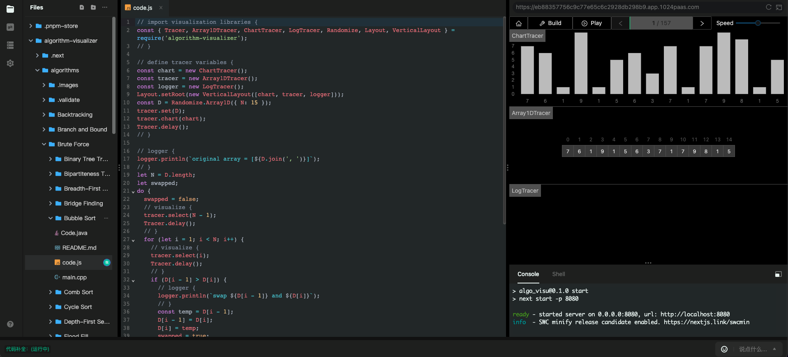

# Algorithm Visualizer

> Algorithm Visualizer is an interactive online platform that visualizes algorithms from code.

Learning an algorithm gets much easier with visualizing it. Don't get what we mean? Check it out:

[https://1024code.com/ide/C3Dmuxs](https://1024code.com/ide/C3Dmuxs)



## Environment Initialization

### cpp

``` shell
vi .1024nix
### 添加 pkgs.curl.dev
nix-shell .1024nix

curl --create-dirs -o /usr/local/include/nlohmann/json.hpp -L "https://github.com/nlohmann/json/releases/download/v3.1.2/json.hpp"
curl --create-dirs -o /usr/tmp/algorithm-visualizer.tar.gz -L "https://github.com/algorithm-visualizer/tracers.cpp/archive/v2.3.6.tar.gz"
cd /usr/tmp
mkdir algorithm-visualizer
tar xvzf algorithm-visualizer.tar.gz -C algorithm-visualizer --strip-components=1
cd /usr/tmp/algorithm-visualizer
mkdir build
cd build
cmake ..
make install
### 测试环境是否安装成功
g++ main.cpp -o Main -O2 -std=c++11 -lcurl -B "/var/empty/local"
ALGORITHM_VISUALIZER=1 ./Main
```