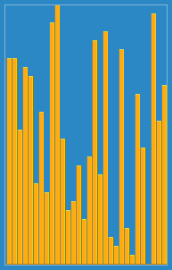

# 插入排序（Insertion Sort）

插入排序（英语：Insertion Sort）是一种简单直观的排序算法。它的工作原理是通过构建有序序列，对于未排序数据，在已排序序列中从后向前扫描，找到相应位置并插入。插入排序在实现上，通常采用in-place排序（即只需用到)的额外空间的排序），因而在从后向前扫描过程中，需要反复把已排序元素逐步向后挪位，为最新元素提供插入空间

## 时间空间复杂度

|  |  |
| --- | :--- |
| 平均时间复杂度 | ) |
| 最坏时间复杂度 | ) |
| 最优时间复杂度 | ) |
| 空间复杂度 | 总共)，需要辅助空间)  |
| 最佳解 | No |

## 参考

- [trekhleb/javascript-algorithms](https://github.com/trekhleb/javascript-algorithms/tree/master/src/algorithms/sorting/insertion-sort)
- [Wikipedia](https://en.wikipedia.org/wiki/Insertion_sort)
- [直接插入排序](https://baike.baidu.com/item/%E7%9B%B4%E6%8E%A5%E6%8F%92%E5%85%A5%E6%8E%92%E5%BA%8F)
